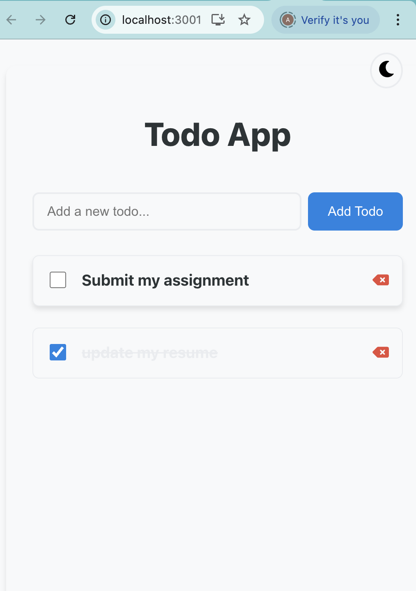
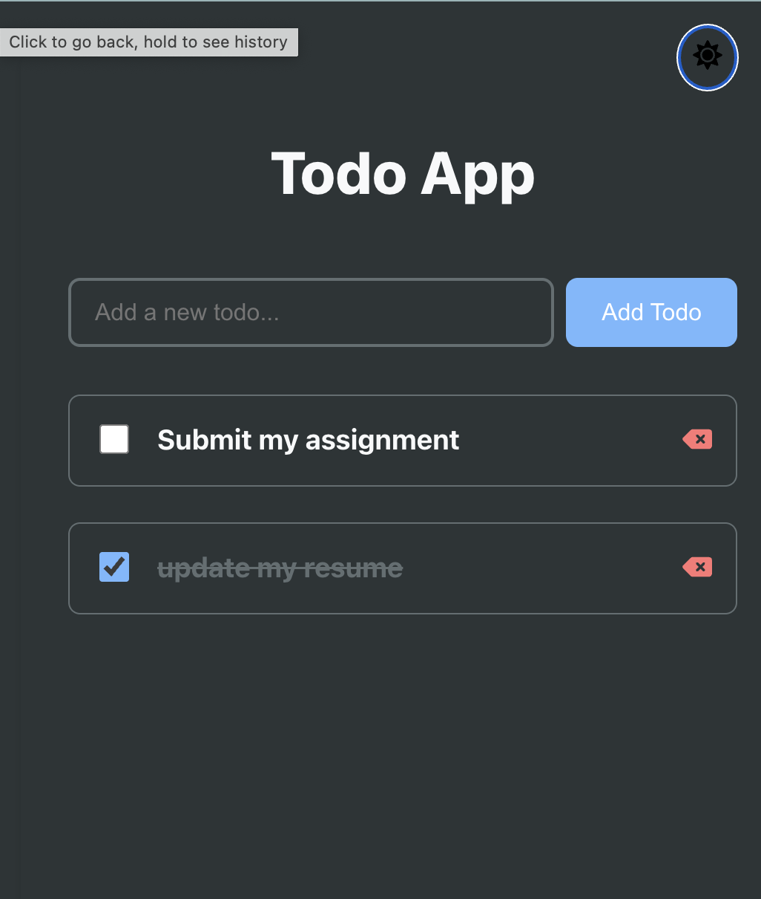

# Modern Task Control/Todo List Application

A sleek, secure, and feature-rich Todo List application built with React and Ruby on Rails. This project demonstrates modern web development practices, including authentication, user-specific data, JWT, and a beautiful dark/light theme toggle.


---

## ✨ Features

- 📝 Create, read, update, and delete todos
- 🔒 User authentication (JWT-based, secure)
- 👤 User-specific todo lists
- ✅ Mark todos as complete/incomplete
- 🏷️ Categories and priorities for todos
- 🎨 Modern, responsive, and mobile-friendly design
- 🌗 Dark/Light theme toggle
- ⌨️ Keyboard support (Enter to add todos)
- 📱 Mobile-friendly interface
- ⚡ Real-time updates
- 🎯 Input validation
- 🎭 Smooth animations and transitions

---

## 🖼️ Screenshots

| Light Mode | Dark Mode |
|------------|-----------|
|  |  |

---
screenshots/login.png
screenshots/register.png


---

## 🛠️ Technologies Used

### Frontend
- React 19.1.0
- React Icons
- Axios for API calls
- React Router DOM
- Modern CSS with Flexbox & CSS variables
- Responsive Design

### Backend
- Ruby on Rails 8.0
- JWT for authentication
- RESTful API architecture
- SQLite (default) or PostgreSQL
- CORS enabled for cross-origin requests

---

## 🏗️ Project Structure

```
TodoList/
├── frontend/               # React frontend application
│   ├── src/
│   │   ├── components/    # React components
│   │   ├── api/          # API integration
│   │   └── styles/       # CSS styles
│   └── public/           # Static files
│
└── backend/              # Ruby on Rails backend
    ├── app/
    │   ├── controllers/  # API controllers
    │   └── models/       # Database models
    └── config/          # Rails configuration
```

---

## 🚀 Getting Started

### Prerequisites
- Node.js (v14 or higher)
- Ruby (v3.0 or higher)
- Rails (v8.0 or higher)
- SQLite or PostgreSQL

### Installation

1. **Clone the repository**
   ```bash
   git clone https://github.com/yourusername/TodoList.git
   cd TodoList
   ```

2. **Set up the backend**
   ```bash
   cd backend
   bundle install
   rails db:drop db:create db:migrate
   rails server
   ```

3. **Set up the frontend**
   ```bash
   cd frontend
   npm install
   npm start
   ```

The application will be available at:
- Frontend: http://localhost:3001
- Backend: http://localhost:3000

---

## 🎯 API Endpoints

| Method | Endpoint | Description |
|--------|----------|-------------|
| POST   | /api/auth/register | Register a new user |
| POST   | /api/auth/login    | Login and get JWT token |
| GET    | /api/todos         | Get all todos for current user |
| POST   | /api/todos         | Create a new todo (auth required) |
| PATCH  | /api/todos/:id/update_completed | Update todo completion status |
| DELETE | /api/todos/:id     | Delete a todo |

---

## 💻 Usage

1. **Register** a new account or **login** with an existing one.
2. Add a new todo by typing in the input field and pressing Enter or clicking "Add Todo".
3. Mark a todo as complete by clicking the checkbox.
4. Delete a todo by clicking the delete icon.
5. Toggle between dark and light mode using the theme button.
6. All changes are automatically saved and are user-specific.

---

## 🎨 UI/UX Features

- Clean and minimalist design
- Smooth hover effects and transitions
- Responsive layout for all screen sizes
- Visual feedback for user actions
- Intuitive interface with clear affordances
- Dark/Light theme toggle

---

## 🔒 Security
- Passwords are securely hashed (bcrypt)
- JWT-based authentication for all API requests
- User data is isolated and protected

---

## 🤝 Contributing

Contributions are welcome! Please feel free to submit a Pull Request.

1. Fork the project
2. Create your feature branch (`git checkout -b feature/AmazingFeature`)
3. Commit your changes (`git commit -m 'Add some AmazingFeature'`)
4. Push to the branch (`git push origin feature/AmazingFeature`)
5. Open a Pull Request

---


## 👥 Author

- Amirhossein Mansouri

---

## 🙏 Acknowledgments

- React.js community
- Ruby on Rails community
- All contributors who have helped shape this project

---

⭐️ If you like this project, please give it a star on GitHub!
